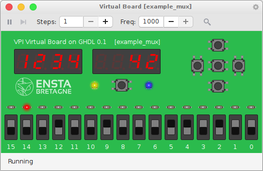
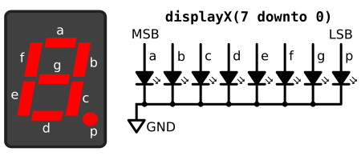
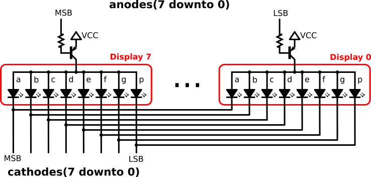
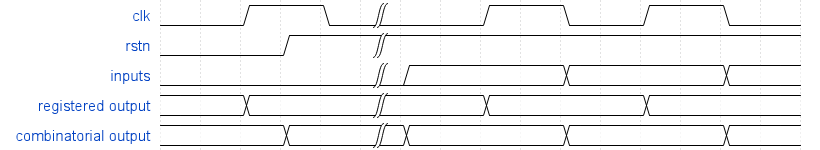
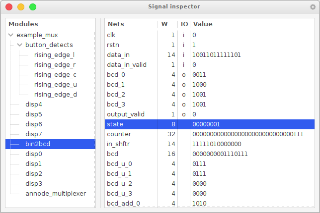

GHDL VPI virtual board
======================

VPI virtual board is a VPI application compatible with the GHDL simulator,
that virtualizes the IOs of a Nexys-4 like board. 

The aim of this software is to give students a simple platform to play with [VHDL](https://en.wikipedia.org/wiki/VHDL)
through the open source [GHDL](https://ghdl.readthedocs.io/en/latest/about.html#what-is-ghdl) simulator,
while beeing able to dynamically play with the design inputs and see the result in real time instead of
viewing signal traces post simulation.




How to use with your design
---------------------------

The virtual board is a [VPI](https://en.wikipedia.org/wiki/Verilog_Procedural_Interface) plugin.
Thereby, neither special elaboration/compilation steps nor VHDL source code modifications are requiered to work with the virtual board.
It even works with GHDL's `mcode` back-end wich does no produce any executable file! 

The only constraint is the name, width and direction of the top-level entity's IO signals.

Simply write your design. No need for a testbench: the clock will be generated by the virtual board in real-time.
To be recognized, the clock input signal of the top-level entity must be named `clk` and have a width of one bit.
If other top-level IO signals are matched, they will be used:

| Name     | Direction | Width | Description                                                                 |
|:---------|:----------|------:|:----------------------------------------------------------------------------|
| clk      | in        |     1 | Clock signal, controled through the play/pause and step buttons             |
| rstn     | in        |     1 | Reset push button (under the displays), `0` when pressed, `1` otherwise     |
| switches | in        |    16 | 16 on/off switches (bottom of the board)                                    |
| button_u | in        |     1 | "Up" push button, `1` when pressed, `0` otherwise                           |
| button_d | in        |     1 | "Down" push button, `1` when pressed, `0` otherwise                         |
| button_r | in        |     1 | "Right" push button, `1` when pressed, `0` otherwise                        |
| button_l | in        |     1 | "Left" push button, `1` when pressed, `0` otherwise                         |
| button_c | in        |     1 | "Center" push button, `1` when pressed, `0` otherwise                       |
| leds     | out       |    16 | 16 red LEDs (on top of the switches), `1` to light up, `0` to switch off    |
| rgb0     | out       |     3 | RGB LED (left of the reset button), red is LSB, blue is MSB                 |
| rgb1     | out       |     3 | RGB LED (right of the reset button), red is LSB, blue is MSB                |
| display0 | out       |     8 | Rightmost 7 segment display, `1`: segment on, `0`: segment off              |
| display1 | out       |     8 | 7 segment display, `1`: segment on, `0`: segment off                        |
| display2 | out       |     8 | 7 segment display, `1`: segment on, `0`: segment off                        |
| display3 | out       |     8 | 7 segment display, `1`: segment on, `0`: segment off                        |
| display4 | out       |     8 | 7 segment display, `1`: segment on, `0`: segment off                        |
| display5 | out       |     8 | 7 segment display, `1`: segment on, `0`: segment off                        |
| display6 | out       |     8 | 7 segment display, `1`: segment on, `0`: segment off                        |
| display7 | out       |     8 | Leftmost 7 segment display, `1`: segment on, `0`: segment off               |
| anodes   | out       |     8 | Common anodes for the eight 7 segment displays, `0`: display on, `1`: display off |
| cathodes | out       |     8 | Common cathodes for the eight 7 segment displays, `0`: segment on, `1`: segment off|

Compile your design and run it as usual, just append the path to the virtual board plugin to the run command with the `--vpi=` switch:
```bash
ghdl -a <VHDL_source_files> # analysis
ghdl -e <TOP_LEVEL_ENTITY>  # elaboration
ghdl -r <TOP_LEVEL_ENTITY> --vpi=./virtual_board.vpi # run simulation with virtual board plugin
# You can also give usual arguments to the run command
# For example, to generate a VCD dump file of the simulation
# (which can be opened with gtkwave)
ghdl -r <TOP_LEVEL_ENTITY> --vpi=./virtual_board.vpi --vcd=dump.vcd
```
Of course if you are using one of the GCC or LLVM back-ends of GHDL, 
you can directly invoke the executable file with the `--vpi=` switch instead of the `ghdl -r ...` command.


The 7 segment displays
----------------------

Two different interfaces can be used for the eight 7 segment displays.
* common cathode interface for each display
* common anode displays  
You can use none or one of this interface, but you cannot mix both.


### Common cathode interface



This is the simplest interface: one output bit per segment and per display.
Declare output signals `display0(7 downto 0)` to `display7(7 downto 0)`.
A logic value `1` switch the segment on, a `0` switch it off;


### Common anode

To be more realistic and to be compatible with the [Nexys-4](https://reference.digilentinc.com/reference/programmable-logic/nexys-4/reference-manual) FPGA board,
a common annode with multiplexing is proposed.



Delare two output signals: `anodes(7 downto 0)` and `cathodes(7 downto 0)`.
Cathodes are shared between all the displays, and all anodes from a given display are driven by a PNP transistor.
Thereby to light up a segment from a display, its cathode signal must be low and the anode bit corresponding to
the display must also be low.


The simulation progress
-----------------------

At startup, the board initiates a reset cycle: all inputs are set to zero, then `clk <= '1'`, then the `rstn <= '1'` and finaly `clk <= '0'`.



Once the virtual board is opened, the clock is frozen and the simulation time is paused.
Only outputs which have a combinatorial path which leads to an input may react to input changes when
the clock is frozen (for example if you directly connect the LEDs to the switches).

To advance time, you can press either the run/pause button or the step button. 
The real and simulation time between two clock cycles can be set with the frequency spin button (in Hz).

Internaly, the simulator is paused just after the clock faling edge at the last known delta,
and waits for either input changes or a timer event.
This is why input changes will appear at the falling edges of the clock in simulation dumps.

When the simulation receives a timer event, it will advance half a clock period in simulation time,
rise the clock signal, advance another half clock period in simulation time, reset the clock signal 
then register a new callback to wait for other timer or input events (from the board) at the last known simulation delta.


The virtual board window
------------------------

On the left of the toolbar, the play/pause buttons (keyboard shortcut is space bar) allows to run or stop
the clock.
The (real and simulated) clock frequency is set in Hz in the frequency spin button (from 1 to 1000 Hz).

You can also use the setp button (keyboard shortcut is the 's' key) to run only a given number of clock cycles
before automatically pausing the clock again.
The number of clock cycles run in a step can be set in the steps spin button.

To change the value of a switch, just click on it, or scroll up or down over it whith the mouse.

To use a push button, click on it, or turn the scroll button while the mouse is over it to generate short presses.

You can also use the keyboard. Click in the main board (green area) to make sure it has keyboard focus, 
then use the numeric keypad '4', '6', '8', '2', and '5' for left, right, up, down and center push buttons, 
'0' for the reset button.

Switches 0 to 7 can be toggled with keys 'c', 'v', 'b'...,
switches 8 to 15 can be toggled with keys starting from 'f', 'g', 'h'...

The signal inspector window
---------------------------

On the right of the toolbar, the inspector button opens the signal inspector window.
It is composed of two panes:
the left one allows to browse the module hierarchy, while the right pane shows in real time the
value of the signals from the selected module.
By right-clicking on signals, you can choose to display them either in binary, decimal or hexadecimal.




How to compile the virtual board plugin
---------------------------------------

First, you will need a working GHDL (v0.36 or higher) in your path.
Either one of GHDL's back-ends will work (mcode, GCC or LLVM).

To [build and install](https://ghdl.readthedocs.io/en/latest/getting/mcode.html) the latest GHDL version:
```bash
sudo apt install build-essential gnat
git clone https://github.com/ghdl/ghdl
cd ghdl
mkdir build && cd build
../configure --prefix=/usr/local --enable-libghdl --enable-synth
make
sudo make install
```

To build the VPI application:
```bash
sudo apt install libgtkmm-3.0-dev build-essential
git clone https://gitlab.ensta-bretagne.fr/bollenth/ghdl-vpi-virtual-board.git
cd ghdl-vpi-virtual-board
make
```
It will produce the shared object `./build/virtual_board.vpi`.

You can try it with the provided example VHDL:
```bash
make exec
```


